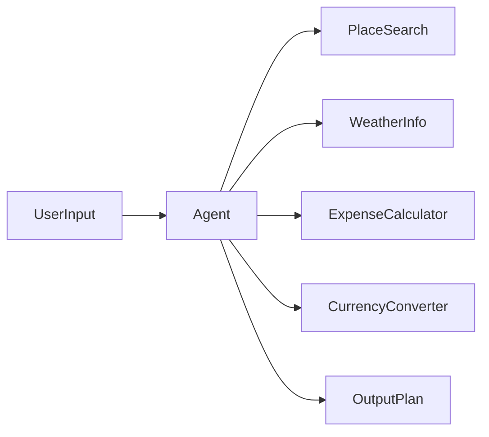

# END TO END  AGENTIC AI TRIP PLANNER


**An intelligent, end-to-end travel planning assistant powered by LangGraph, with a Streamlit frontend and Flask backend.**

## 🚀 Overview

Agentic AI Trip Planner is a modular, agent-based application that creates personalized, day-by-day travel itineraries for any number of days. Powered by LangGraph and advanced LLM reasoning, it automates all aspects of trip planning—from destination research to budgeting—using a set of specialized tools.

## 🧩 Features

- **Expense Calculator:** Get accurate, itemized cost estimates for your trip.
- **Place Searching:** Discover top attractions, dining, and activities at your destination.
- **Live Weather Info:** Integrates up-to-date weather data to optimize daily plans.
- **Currency Conversion:** Converts budgets and expenses into your preferred currency with real-time rates.
- **Full Start-to-End Planning:** Enter your destinations and dates, and receive a complete, actionable itinerary.

## 🛠️ Tech Stack

- **Frontend:** Streamlit (user-friendly, interactive UI)
- **Backend:** Flask (modular API server)
- **AI Agent:** LangGraph (agentic workflow orchestration)
- **LLM:**  Groq
- **APIs:** Weather, currency, and place information providers

## 🏗️ Modular Code Structure

  - `app.py` - Streamlit UI components and logic
  - `main.py` - Flask server and API endpoints
  - `agent/` - LangGraph agent and tool definitions
  - `tools/` - Modular tool implementations (expense, weather, currency, search)
  - `utils/` - Helper functions and shared utilities

## ⚡ How It Works

1. **User Input:** Enter your trip details (destinations, dates, preferences) in the Streamlit app.
2. **Agentic Planning:** The backend agent uses LangGraph to sequence tool invocations—searching for places, checking weather, calculating expenses, and converting currencies.
3. **Personalized Output:** Receive a day-by-day itinerary with cost breakdown, weather-aware suggestions, and currency-adjusted budgets.

## 🖥️ Getting Started

### Prerequisites

- Python 3.9+
- [pip](https://pip.pypa.io/en/stable/)

### Installation

```bash
git clone https://github.com/maskedwolf4/Agentic-AI-Trip-Planner
cd agentic-ai-trip-planner
pip install -r requirements.txt
```

### Running the Application

1. **Start the Flask Backend:**
   ```bash
   python main.py
   ```

2. **Start the Streamlit Frontend:**
   ```bash
   streamlit run app.py
   ```

3. **Open your browser** and go to the Streamlit URL (usually [http://localhost:8501](http://localhost:8501)).

## 📦 Example Usage

1. Enter your destination(s), travel dates, and preferences.
2. Click "Generate Plan".
3. View your complete itinerary, with daily breakdowns, weather info, and cost in your chosen currency.

## 🤖 Agentic Workflow Example



**Contributions and suggestions are welcome!**

Let me know if you want to include API keys/config instructions, deployment tips, or a sample screenshot section!
